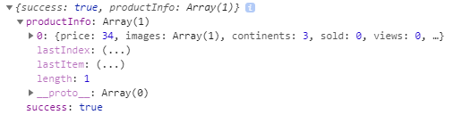

# 상품 목록을 랜딩 페이지에 뿌려주기

## 1. 빈 랜딩 페이지 생성

## 2. 몽고DB에 저장되어 있는 데이터 가져오기
- `LandginPage`에서 `useEffect`와 `axios`를 사용해서 몽고DB에 저장되어 있는 데이터를 가져옵니다.
- 지금은 아무런 필터없이 가져올 것이기 때문에 `body`를 전달할 필요는 없습니다.
### [LandingPage.js의 일부]
```js
useEffect(() => {

        axios.post('/api/product/products')
            .then(response => {
                if(response.data.success) {

                } else {
                    alert("상품을 가져오는 데 실패 했습니다.");
                }
            })

    }, [])
```
- `routes/product`로 가서 라우터를 하나 더 만듭니다.

### [routes/product의 일부]
```js
router.post('/products', (req, res) => {
    //product Collection에 들어 있는 모든 상품 정보 가져오기
    //find() => Collection안에 모든 정보를 찾는다.
    //populate(doc) => 해당 필드에 대한 모든 정보를 가져온다.
    Product.find()
        .populate('writer')
        .exec((err, productInfo) => {
            if(err) return res.status(400).json({ success: false, err })
            return res.status(200).json({ success: true, productInfo})
        })
})
```
- 프론트에서 확인 합니다.



- 정상적으로 정보를 가져옵니다.

## 3. 랜딩 페이지 UI 만들기
- 기본 UI 뼈대 입니다.
```js
return (
    <div style={{ width: '75%', margin: '3rem auto'}}>

        <div style={{ textAlign: 'center' }}>
            <h2>여행을 떠나자!</h2>
        </div>

        {/* Filter */}

        {/* Search */}

        {/* Cards */}

        <div style={{ display: 'flex', justifyContent: 'center' }}>
            <button>더보기</button>
        </div>
    </div>
)
```
- CARD를 만들기 위해 `antd`디자인을 사용합니다.
### [LandingPage의 일부]
```js
import { Icon, Col, Row, Card } from 'antd';
```

- 백에서 가져온 모든정보(`productInfo`)를 `state`로 관리합니다.

```js
const [Products, setProducts] = useState([])

useEffect(() => {

    axios.post('/api/product/products')
        .then(response => {
            if(response.data.success) {
                console.log(response.data);
                //가져온 모든 데이터를 state로 관리한다.
                setProducts(response.data.productInfo)

            } else {
                alert("상품을 가져오는 데 실패 했습니다.");
            }
        })

}, [])
```

- `map`을 이용해서 `productInfo`만큼 `CARD`를 만드는데 렌더링 되는 곳에서 만들지 않고 따로 빼서 생성합니다.

```js
const renderCards = Products.map((product, index) => {
    
    return <Card>
        <Meta/>
    </Card>
})

return (
    ...생략
    {/* Cards */}
    {renderCards}
)
```

- 정보를 가져와 봅니다.

```js
return <Card
    key={index}
    cover={}
>
    <Meta
        title={product.title}
        description={`$${product.price}`}
    />
</Card>
```

- 반응형 디자인을 합니다.

```js
const renderCards = Products.map((product, index) => {
    
    return <Col key={index} lg={6} md={8} xs={24}>

    <Card
        cover={}
    >
        <Meta
            title={product.title}
            description={`$${product.price}`}
        />
    </Card>
    </Col>
})

return (
    <div style={{ width: '75%', margin: '3rem auto'}}>
    ...생략...

        {/* Cards */}
        <Row gutter={[16,16]} >
            {renderCards}
        </Row>

    ...생략...

    </div>
)
```
- 지금은 하나의 이미지만 가져오는데 이 것을 각 정보에 맞게 이미지를 가져오고 슬라이딩 되게 할 겁니다.

- `antd`디자인의 `Carousel`을 사용해서 바꿀 겁니다.

- `Carousel`을 가져와서 `Card`태그 안에다가 넣어주면 되지만 이렇게 하면 코드가 너무 지저분해집니다. 그래서 이미지 슬라이더 부분은 새로운 컴포넌트를 만들어서 사용합니다.

- `utils`폴더안에 `ImageSlider.js`파일 생성

### [ImageSlider.js의 일부]
```js
import React from 'react'
import { Carousel } from 'antd';

function ImageSlider() {
    return (
        <div>
            <Carousel>
                
                <div>
                    <h3>1</h3>
                </div>

                <div>
                    <h3>2</h3>
                </div>

                <div>
                    <h3>3</h3>
                </div>

                <div>
                    <h3>4</h3>
                </div>

            </Carousel>
        </div>
    )
}
export default ImageSlider
```
- 해당 컴포넌트를 `LandingPage`에서 사용하기 위해 import합니다.

```js
import ImageSlider from './../../utils/ImageSlider';
```
- import 후에 해당 컴포넌트를 `CARD`의 `cover`속성안에 넣습니다.

```js
const renderCards = Products.map((product, index) => {
    
    return <Col key={index} lg={6} md={8} xs={24}>
    <Card
        cover={<ImageSlider />}
    >
        <Meta
            title={product.title}
            description={`$${product.price}`}
        />
    </Card>
    </Col>
})
```

- `ImageSlider`를 수정합니다.
- `LandingPage`에 저장되어 있는 이미지 정보가 필요합니다.
- `props`를 이용해서 해당 정보를 가져오겠습니다.
- `images`라는 이름의 props를 정의하고 `product.images`를 받습니다.

## 4. 상품 목록 화면에 뿌리기

### [ImageSlider.js의 일부]
```js
import React from 'react'
import { Carousel } from 'antd';

function ImageSlider(props) {
    return (
        <div>
            <Carousel autoplay>
                {props.images.map((image, index) => (
                    <div key={index}>
                        
                    </div>
                ))}
            </Carousel>
        </div>
    )
}

export default ImageSlider
```
